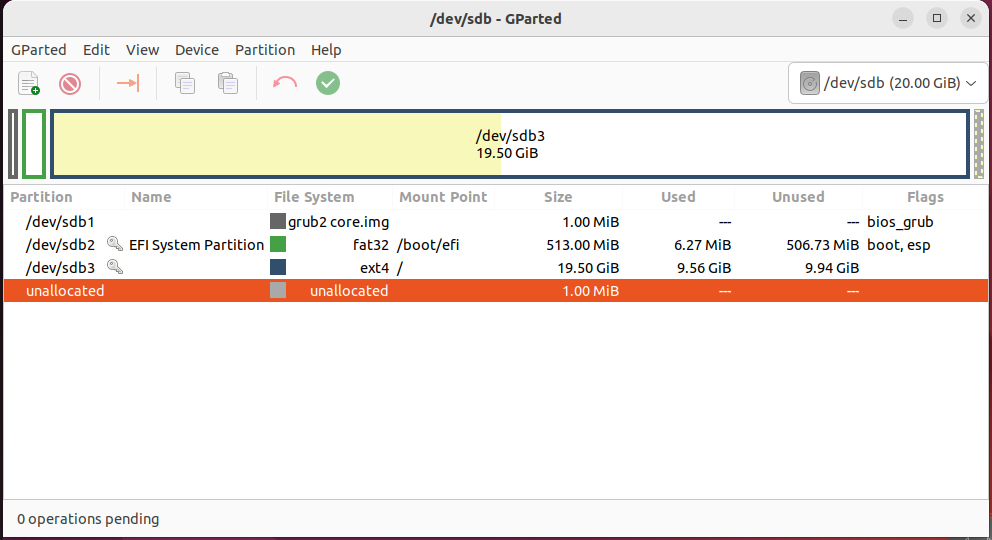
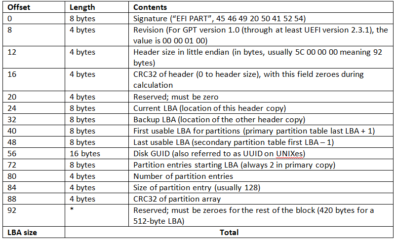
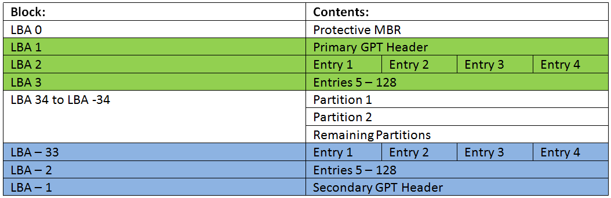
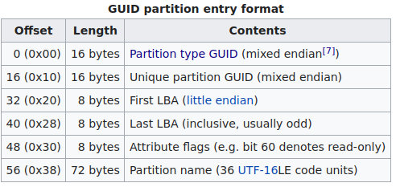

# Labo_bestandssystemen

Download volgende ovf's:
- Voor Intel/AMD:
  - [Debian zonder partities](https://files.ucll.be/Handlers/Download.ashx?file=Education%2FCourseInfo%2FManagement%20en%20Technologie%2FTechnologie%20Leuven%2FComputer%20Systems%2FOVA%2FLabo%20Partities%2FLab_Debian_zp.ova&action=download)
  - [Debian met partities](https://files.ucll.be/Handlers/Download.ashx?file=Education%2FCourseInfo%2FManagement%20en%20Technologie%2FTechnologie%20Leuven%2FComputer%20Systems%2FOVA%2FLabo%20Partities%2FLab_Debian_mp.ova&action=download)
- Voor MAC M1/M2:
  - [Debian zonder partities]()
  - [Debian met partities]()

Importeer deze ova's in VmWare. Indien dit gelukt is, zou je nu twee nieuwe virtuele machines in je lijst moeten hebben.

## Harde schijf zonder partities
Start de VM met naam "Debian_zp". Je zal merken dat dit een linux server is zonder GUI. Om in te loggen mag je volgende gegevens gebruiken:
  - Username: ucll
  - Password: ucllrocks

Het eerste wat we gaan doen is nagaan hoeveel harde schijf ruimte er beschikbaar is op deze servers. Dit doe je door het commando `df` te gebruiken. Normaal krijg je volgende overzicht:
```bash
ucll@debian-zp:~$ df
Filesystem     1K-blocks    Used Available Use% Mounted on
udev              981152       0    981152   0% /dev
tmpfs             199604     712    198892   1% /run
/dev/sda2       18964304 1501568  16474064   9% /
tmpfs             998004       0    998004   0% /dev/shm
tmpfs               5120       0      5120   0% /run/lock
/dev/sda1         523244    3496    519748   1% /boot/efi
tmpfs             199600       0    199600   0% /run/user/1000
```
Hoewel dit een duidelijk overzicht geeft van alle partities die aangemaakt zijn op de harde schijf, moet je zelf nog aan de slag om uit te rekenen wat de exacte schijfruimte is. Het commando `df` heeft echter een optie om dit zelf te bereken alvorens het overzicht te tonen. Hiervoor heb je in vorige labo's geleerd om gebruik te maken `--help` dat je het gebruik van het commando weergeeft. Er bestaat ook een andere manier om de details van een commando te achterhalen: `man`. Dit gebruik je steeds als volgt: `man <commando>`. Probeer nu zelf te achterhalen welke optie je moet meegeven aan het commando `df` om het overzicht in een leesbaar formaat te hebben.

Ja kan nu zien dat er nog voldoende ruimte vrij is op de harde schijf. Hier gaan we verandering in brengen. Voer volgende commando's uit:
```bash
su -
```
Dit commando zorgt dat we root worden. `su` wil namelijk zeggen 'set user', '-' wil zeggen root (en nog wat extra zaken, die nu nog niet belangrijk zijn). Root is de user dat in linux alle rechten heeft en dus ook alles mag doen op het systeem. Na het uitvoeren van het commando zal er gevraagd worden achter het wachtwoord. Dit is net hetzelfde als het wachtwoord van 'ucll' user *(dit is inderdaad niet veilig en het wachtwoord op zich ook niet, maar we zitten in een testomgeving waar we geen belangrijke documenten hebben staan of toegang hebben tot kritische onderdelen. Toch fijn dat je al zelf die gedachten hebt gemaakt. Dat wil zeggen dat je security hoog in het vaandel draagt)*

Vervolgens voeren we volgende commando uit. Met wat je ondertussen hebt geleerd over Python en 'Linux Unhatched' zou dit normaal voleldig moeten begrijpen. Zoniet, zal `man` en 'Google' je al een heel eind verder brengen om het volledig te begrijpen.
```bash
for foo in {1..100}; do dd of=/var/log/$foo.full if=/dev/zero bs=1M count=100; done
```
Achterhaal hoeveel ruimte er nog vrij is op de harde schijf na het uitvoeren van dit commando.

Je zal merken dat alle beschikbare ruimte op de harde schijf is ingenomen. Op het eerste zicht lijkt het alsof het systeem nog perfect werkt. Probeer nu om de applicatie 'screen' te installeren. Met wat je hebt geleerd in vorige labo's zou dit geen probleem mogen zijn.

:question: Kan het systeem de applicatie installeren?

:question: Waarom wel/niet?

Je mag de vm afsluiten door gebruik te maken volgend commando:
```bash
shutdown -h now
```

## Harde schijf met parties
Start nu de vm 'Debian_mp' op.
Voer volgende stappen uit in deze vm:
- Log in met de ucll gebruiker
- Word 'root'
- Kijk na hoeveel vrije ruimte er op de harde schijf/partities is.
- Voer het volgende commando uit: `for foo in {1..100}; do dd of=/var/log/$foo.full if=/dev/zero bs=1M count=100; done`
- Kijk na hoeveel ruimte er nog beschikbaar is op de harde schijf/partities
- Installeer de applicate 'screen'

:question: Lukt het nu wel om de applicatie te installeren?

:question: Waarom wel/niet?

Na dit deel van het labo zou het duidelijk moeten zijn wat één van de voordelen is van het gebruik van partities.

## Partities
Nu we het nut van partities kennen, wordt het tijd om zelf te leren hoe je partities moeten aanmaaken, hetgeen niet zo moeilijk is. Hiervoor bestaan er heel wat tools die zowel in Linux als Windows beschikbaar zijn. Voor dit labo gaan wij gebruik maken van `parted`. Het voordeel van parted is, dat hiervoor ook een GUI applicatie is geschreven, dewelke je in Ubuntu kan gebruiken: `GParted`.

Voor we zelf partities gaan aanmaken, gaan we eerst even een partitietabel van dichterbij bekijken.
### GParted

Zorg dat alle voorgaande VM's correct afgesloten worden en start daarna je Ubuntu VM van het eerste labo. 'GParted' is normaal niet standaard geïnstalleerd op je vm. Het eerste wat we dus moeten doen is 'GParted' installeren.

Als je dat gedaan hebt en je start 'GParted' op, krijg je normaal volgend scherm te zien.



Dit geeft je een overzicht van alle partities die op de harde schijf ter beschikking zijn. In dit overzicht krijgen we al heel wat informatie:
- **Partition**: hier krijgen we de naam zoals dit gekend is op hardware niveau in het systeem.
- **Name**: Bij het aanmaken van een partitie kunnen we een meer gebruiksvriendelijkere naam configureren
- **File system**: Zoals we gezien hebben in de theorie moet elke paritie geformateerd worden in een bepaald filesysteem voor we gebruik kunnen maken van de partitie om files en directories aan te maken.
- **Mount Point**: Naast een hardware verwijzing moet er ook een 'mount point' geconfigureerd worden. Dit is eigenlijk een directory waarin het filesysteem van die partitie beschikbaar wordt gemaakt voor het OS.
- **Flags**: Voor elke partitie kunnen we bepaalde vlaggen instellen die een extra functionaliteit toevoegen aan een partitie. Zo moet er minstens 1 partitie met de 'boot flag' geconfigueerd worden om ervoor te zorgen dat het OS kan opstarten. De BIOS zal na zijn post immers deze partitie gebruiken om het OS te kunnen laten opstarten.

Indien je nog meer details wilt weten over een bepaalde partitie volstaat om deze partitie te selecteren, rechter muisklik, 'Information'. Dit zal ook GUID laten zien, alsook de eerste en laatste sector die gebruikt is voor de partitie.

💡 Doe dit ook werkelijk voor alle partities!

### Parted
Ook in cli kan je de partities bekijken van een harde schijf door gebruik te maken van `parted`. Zorg dat je de vm 'Debian_mp' opstart. Eenmaal opgestart voer volgende commando uit als root:
```bash
root@debian-mp:~# parted /dev/sda
GNU Parted 3.4
Using /dev/sda
Welcome to GNU Parted! Type 'help' to view a list of commands.
(parted)                                                                  
```
Typ nu `print`. Dit zou je normaal een overzicht moeten geven van alle partities die zich op je vm bevinden:
```bash
Model: VMware, VMware Virtual S (scsi)
Disk /dev/sda: 21.5GB
Sector size (logical/physical): 512B/512B
Partition Table: gpt
Disk Flags: 

Number  Start   End     Size    File system     Name  Flags
 1      1049kB  538MB   537MB   fat32                 boot, esp
 2      538MB   4862MB  4324MB  ext4
 3      4862MB  6636MB  1774MB  ext4
 4      6636MB  7661MB  1024MB  linux-swap(v1)        swap
 5      7661MB  8046MB  385MB   ext4
 6      8046MB  21.5GB  13.4GB  ext4

```
### Analyse

Hoewel Parted en GParted ons een mooi overzicht geven, is het ook mogelijk dit nog een stapje verder te zetten: puur naar de bytes gaan kijken. Alle applicaties voor het aanmaken of aanpassen van partities doen dit immers ook. Dit gaan we echter in verschillende stappen moeten doen:

#### GPT tabel extracten:
We hebben in de theorie gezien dat de GPT partitietabel zich in de eerste LBA's van een harde schijf bevind. Door gebruik te maken van `dd` kunnen we de nodige bytes kopieren naar een bestand. De meeste belangrijkste bytes bevinden zich in de GPT Header. Standaard zal deze zich in LBA 1 bevinden. Het commando om deze te kopieëren is: 
```bash
dd if=/dev/sda of=/root/header bs=512 skip=1 count=1
```
Na het uitvoeren van dit bestand bevindt de volledige inhoud van LBA 1 zich in de file 'header'.

#### GPT header bekijken
Probeer deze file nu eens uit te lezen. Het commando hiervoor hebben we al geleerd.

Echter dit geeft enkel volgende output (kan je ook verklaren waarom?):
```
EFI PART\�����"��P�d5�;D���K�������}a
```

Om de header file correct te kunnen uitlezen, kan je gebruik maken van het commando `hexyl`. Indien je dit correct gedaan hebt, zou je volgende output moeten hebben:
```
┌────────┬─────────────────────────┬─────────────────────────┬────────┬────────┐
│00000000│ 45 46 49 20 50 41 52 54 ┊ 00 00 01 00 5c 00 00 00 │EFI PART┊00•0\000│
│00000010│ a8 b4 ef be 00 00 00 00 ┊ 01 00 00 00 00 00 00 00 │××××0000┊•0000000│
│00000020│ ff ff 7f 02 00 00 00 00 ┊ 22 00 00 00 00 00 00 00 │×ו•0000┊"0000000│
│00000030│ de ff 7f 02 00 00 00 00 ┊ 50 9e 64 1f 35 db 3b 44 │×ו•0000┊P×d•5×;D│
│00000040│ b1 b0 f6 4b e5 fa 8e b5 ┊ 02 00 00 00 00 00 00 00 │×××K××××┊•0000000│
│00000050│ 80 00 00 00 80 00 00 00 ┊ d2 14 7d 61 00 00 00 00 │×000×000┊ו}a0000│
│00000060│ 00 00 00 00 00 00 00 00 ┊ 00 00 00 00 00 00 00 00 │00000000┊00000000│
│*       │                         ┊                         │        ┊        │
│00000200│                         ┊                         │        ┊        │
└────────┴─────────────────────────┴─────────────────────────┴────────┴────────┘
```
Dit is letterlijk de hexadecimale output van de headerfile (en dus eigenlijk van LBA 1 waar de header van de GPT tabel zich bevindt). Om alle verschillende onderdelen uit de tabel te halen, zou je kunnen tellen om zo de juiste bytes eruit te kunnen halen. Het commando `hexyl` heeft echter een aantal opties waardoor het niet nodig is om handmatig te tellen.



Probeer aan de hand van bovenstaande tabel en het `hexyl` command volgend gegevens uit de header file te krijgen:
- Signature
- Current LBA
- Backup LBA
- Aantal partities in de tabel
- Grootte van item in partietitabel

❓Hoeveel partitie items bevinden zich in de tabel?
❓Wat is de grootte van een partitie item in de tabel?

Voor deze vragen zal je je kennis moeten gebruiken van de talstelsels dat we in de eerste week hebben gezien.

#### GPT entry bekijken

Pas volgende commando correct aan zodat je de inhoud van LBA2 in een nieuwe file zet
```bash
dd if=/dev/sda of=/root/header bs=512 skip=1 count=1
```


Zorg dat je volgende gegevens uit de juist aangemaakte file kan halen:
- Eerste LBA
- Laatste LBA

### Partities aanmaken

#### Fysieke Harde schijf toevoegen

- Voeg een nieuwe harde schijf toe aan de 'Debian_zp' van 30GB toe.
- Start de vm op
- Eenmaal opgestart voer dan volgende command uit: `lsblk`. Dit toont je onder andere een overzicht van alle harde schijven die aangesloten zijn. Je nieuwe harde schijf moet hier normaal ook tussen staan. Zorg dat je duidelijk weet wat je nieuwe toegevoegde harde schijf is. Dit zal normaal `/dev/sda` zijn.

```bash
NAME   MAJ:MIN RM  SIZE RO TYPE MOUNTPOINT
sda      8:0    0   30G  0 disk 
sdb      8:16   0   20G  0 disk 
|-sdb1   8:17   0  512M  0 part /boot/efi
|-sdb2   8:18   0 18.5G  0 part /
`-sdb3   8:19   0  976M  0 part [SWAP]
sr0     11:0    1 1024M  0 rom  
```

#### Mount point aanmaken

- Maak een nieuwe directory aan genaamd: /Party

#### Nieuwe partitietabel aanmaken
Het eerste wat we moeten doen is een partitietabel aanmaken in parted:
```bash
# parted /dev/sda
(parted) mklabel gpt
(parted) print                                                            
Model: VMware, VMware Virtual S (scsi)
Disk /dev/sda: 32.2GB
Sector size (logical/physical): 512B/512B
Partition Table: gpt
Disk Flags: 

Number  Start  End  Size  File system  Name  Flags

(parted)                                                                  
```

#### Nieuwe partie aanmaken met correct filessystem
```
(parted) mkpart                                                           
Partition name?  []? Party                                                
File system type?  [ext2]? ext4                                           
Start? 1                                                                  
End? 10000                                                                
(parted) print                                                            
Model: VMware, VMware Virtual S (scsi)
Disk /dev/sda: 32.2GB
Sector size (logical/physical): 512B/512B
Partition Table: gpt
Disk Flags: 

Number  Start   End     Size    File system  Name   Flags
 1      1049kB  10.0GB  9999MB  ext4         Party

(parted) quit                                                             
```
De partitie is nu aangemaakt, maar om deze nu te kunnen gebruiken moeten we deze nog formateren in het correcte filesysteem. Met het `lsblk -f`commando is het meteen duidelijk de nieuwe aangemaakte partitie nog geen filesysteem heeft. Om dit in orde te maken, maken we gebruik van `mkfs`:
```bash
root@debian-zp:~# lsblk -f
NAME FSTYPE FSVER LABEL UUID                                 FSAVAIL FSUSE% MOUNTPOINT
sda                                                                         
└─sda1
                                                                            
sdb                                                                         
├─sdb1
│    vfat   FAT32       8E96-C30A                             507.6M     1% /boot/efi
├─sdb2
│    ext4   1.0         d07c0dac-6789-46f0-ae72-7cf548295042   15.7G     8% /
└─sdb3
     swap   1           357d776f-78af-4e0f-9ee7-88fad06138bb                [SWAP]
sr0                                                                         
root@debian-zp:~# mkfs -t ext4 /dev/sda1
mke2fs 1.46.2 (28-Feb-2021)
Creating filesystem with 2441216 4k blocks and 610800 inodes
Filesystem UUID: fc2c44f2-382b-488b-b82a-eb4b36b641a9
Superblock backups stored on blocks: 
	32768, 98304, 163840, 229376, 294912, 819200, 884736, 1605632

Allocating group tables: done                            
Writing inode tables: done                            
Creating journal (16384 blocks): done
Writing superblocks and filesystem accounting information: done 
```

#### Partitie mounten

Als alles alles goed is gegaan, zou je normaal nu een nieuwe partitie moeten hebben die je in je systeem kan gebruiken.

▶️ Ga nu zelf aan de slag om nog 2 extra partities aan te maken (De stap van partietabel aanmaken, moet je nu niet meer doen!):
- Partitie 2:
  - 10GB
  - Mount pount: /UCLL
  - Filesystem: Fat32
- Partitie 3:
  - 10GB
  - Mount point: /Rocks
  - Filessystem: NTFS   

### Next Level
Nu je perfect weet hoe een partitie in elkaar zit en hoe je deze kan aanmaken, gaan we een nieuwe Linux distributie installeren:
- Download volgende [iso]().
? Maak dan een nieuwe VM aan
- Nieuwe Mint vm aanmaken met correct partities (indeling zelf geven)

Een goede linux installatie zal minimum steeds bestaan uit volgende partities:
- swap
- /
- /home
- /var
- /tmp
- EFI boot

Deze partities zijn ook geconfigureerd op de 'Debian_mp' vm:
```bash
root@debian-mp:~# lsblk
NAME   MAJ:MIN RM  SIZE RO TYPE MOUNTPOINT
sda      8:0    0   20G  0 disk 
├─sda1   8:1    0  512M  0 part /boot/efi
├─sda2   8:2    0    4G  0 part /
├─sda3   8:3    0  1.7G  0 part /var
├─sda4   8:4    0  977M  0 part [SWAP]
├─sda5   8:5    0  367M  0 part /tmp
└─sda6   8:6    0 12.5G  0 part /home
```

## Raid

Nog eens korte uitleg over RAID

### Raid 1
```
mdadm --create /dev/md/name /dev/sda1 /dev/sdb1 --level=1 --raid-devices=2
```
- Bestand aanmaken
- Afsluiten
- Schijf verwijderen
- terug opstarten
- Bestand nog beschikbaar?
- Nieuwe SSD maken
- Toevoegen aan Raid

### Raid 5
```
mdadm --create /dev/md/name /dev/sda1 /dev/sdb1 /dev/sdc1 --level=5 --raid-devices=3
```
- Meerdere bestanden aanmaken
- Afsluiten
- Schijf verwijderen
- terug opstarten
- Bestanden nog beschikbaar?
- SSD verijderen
- Bestanden nog beschikbaar?
- Nieuwe SSD maken
- Toevoegen aan Raid
